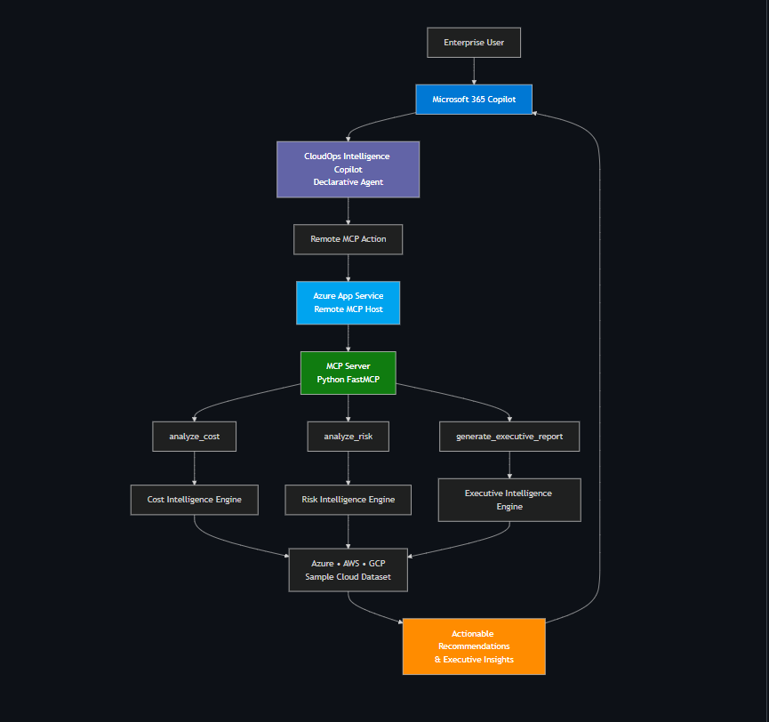
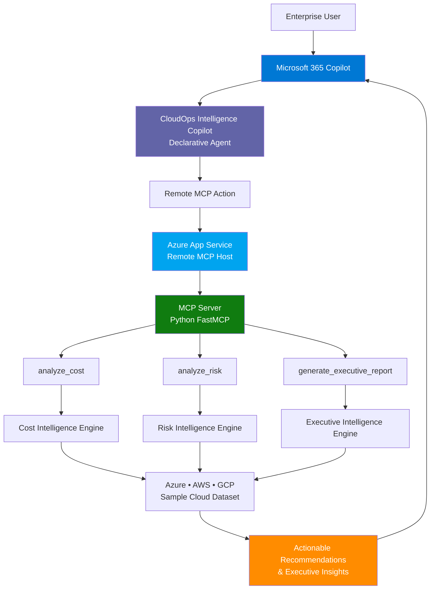
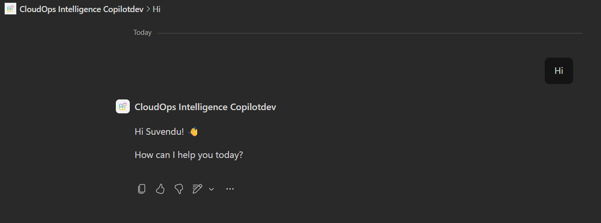
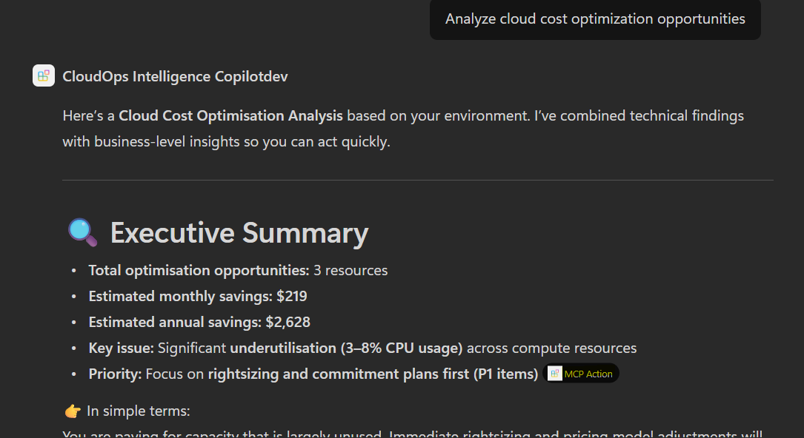
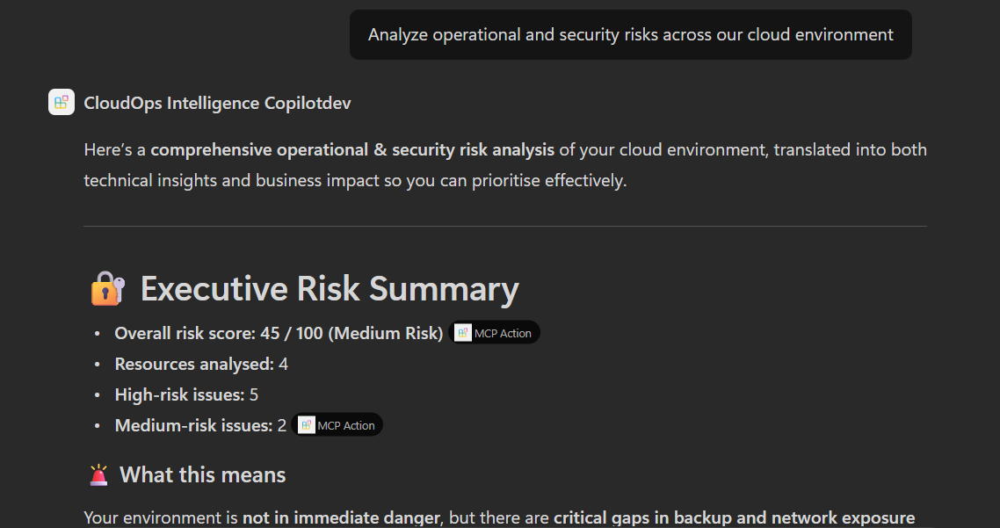
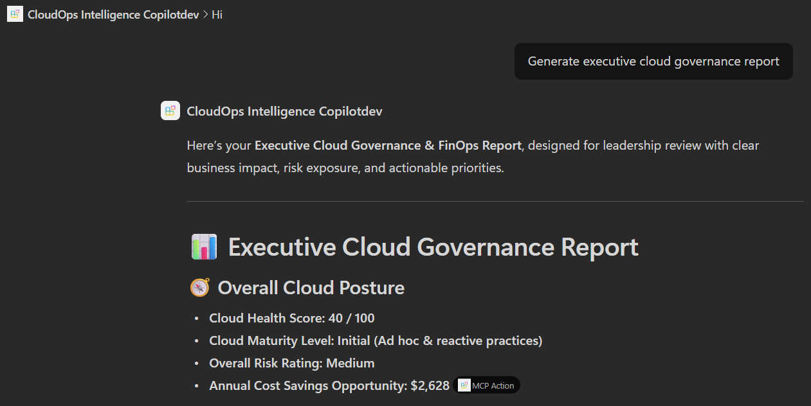
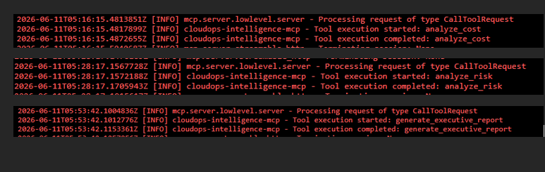

# CloudOps Intelligence Copilot

<p align="center">
  
  
  
  
  
</p>

<p align="center">
  <b>Enterprise Cloud Decision Intelligence Through Microsoft 365 Copilot + MCP</b><br/>
  FinOps optimization, risk visibility, and executive governance reporting in one Copilot-native experience.
</p>

## Executive Summary
CloudOps Intelligence Copilot is a Microsoft 365 Copilot Declarative Agent connected to a remote MCP server hosted on Azure App Service. It transforms conversational AI into tool-grounded cloud governance intelligence by invoking deterministic FastMCP tools for cost optimization, risk analysis, and executive reporting.

The solution is built for enterprise stakeholders across platform engineering, FinOps, SRE, cloud security, and leadership. It provides business-ready answers backed by repeatable tool execution across Azure, AWS, and GCP datasets.

## What Makes This Different
Unlike traditional chatbot experiences that rely solely on LLM reasoning, CloudOps Intelligence Copilot uses the Model Context Protocol (MCP) to invoke deterministic cloud intelligence tools hosted on Azure App Service.

This enables:

- Repeatable and auditable execution
- Reduced hallucination risk
- Explainable recommendations
- Separation of reasoning and execution
- Enterprise-ready governance workflows

Instead of simply summarizing cloud information, the solution executes purpose-built cloud intelligence tools that generate actionable business outcomes.

## Business Problem
Most enterprises face a recurring cloud operations gap:

- FinOps insights are fragmented across billing exports and cloud-native dashboards.
- Risk and governance findings are scattered across engineering workflows.
- Executive reporting is manual and delayed.
- Leadership needs decision-quality intelligence, not raw metrics.

LLM-only conversational systems can summarize information, but they often lack deterministic execution and auditable reasoning paths needed for enterprise governance.

## Solution Overview



*CloudOps Intelligence Copilot architecture showing Microsoft 365 Copilot, Declarative Agent, Remote MCP Actions, Azure App Service hosting a Python FastMCP server, and specialized intelligence engines for cost optimization, risk assessment, and executive governance reporting.*

CloudOps Intelligence Copilot introduces a layered enterprise architecture that separates:

- Reasoning and conversational interface: Microsoft 365 Copilot
- Agent orchestration: Declarative Agent
- Tool invocation protocol: Remote MCP Actions
- Deterministic execution layer: Azure-hosted Python FastMCP server

This allows Copilot to move from chat-based responses to actionable cloud intelligence tasks with explainable outputs.

## Judges Quick View
| Capability | Status |
|---|---|
| Microsoft 365 Copilot Declarative Agent | ✅ |
| Remote MCP Actions | ✅ |
| Azure Hosted MCP Server | ✅ |
| FastMCP Runtime | ✅ |
| Multi-cloud Analysis | ✅ |
| Cost Optimization Tool | ✅ |
| Risk Analysis Tool | ✅ |
| Executive Governance Reporting | ✅ |
| Azure App Service Deployment | ✅ |
| Live MCP Execution Evidence | ✅ |

## Challenge Alignment

### Problem Solved
Cloud teams struggle with fragmented cost visibility, risk management, and executive reporting across multi-cloud environments.

### Solution
CloudOps Intelligence Copilot combines Microsoft 365 Copilot, Declarative Agents, and Azure-hosted MCP tools to deliver actionable cloud intelligence through natural language.

### AI Value
The solution uses MCP-based deterministic tool execution to transform conversational requests into explainable cloud governance insights, reducing manual analysis effort and improving decision quality.

### Business Outcomes
- Improved FinOps visibility
- Faster risk identification
- Executive-ready governance reporting
- Reduced operational overhead

## Key Features
- Cross-cloud cost optimization analysis for Azure, AWS, and GCP
- Operational and security risk intelligence with prioritized findings
- Executive governance reporting for leadership-ready communication
- Copilot-native experience through Declarative Agent interactions
- Remote MCP action execution on Azure App Service
- Tool-grounded architecture for repeatability and reduced hallucination risk

## Architecture
### Component Responsibilities
- Microsoft 365 Copilot: User interaction and natural language interface
- Declarative Agent: Intent mapping and orchestration logic
- Remote MCP Action: Protocol bridge between Copilot and tools
- Azure App Service Remote MCP Host: Secure hosted runtime endpoint
- Python FastMCP Server: Deterministic execution of governance intelligence tools

### Architecture Diagram (Deployed Flow)


## Technology Stack
| Layer | Technologies |
|---|---|
| AI Experience | Microsoft 365 Copilot |
| Agent Layer | Declarative Agent (Microsoft 365 Agents Toolkit) |
| Protocol Layer | Model Context Protocol (MCP), Remote MCP Actions |
| Tool Runtime | Python FastMCP |
| Cloud Hosting | Azure App Service |
| AI Platform | Azure OpenAI |
| Development | GitHub Copilot, VS Code |
| Data Scope | Azure, AWS, and GCP cloud datasets |

## MCP Tools
| Tool | Purpose | Engine Output |
|---|---|---|
| `analyze_cost` | Detect underutilization, rightsizing opportunities, and savings potential | Cost Intelligence Engine |
| `analyze_risk` | Identify operational and security posture concerns | Risk Intelligence Engine |
| `generate_executive_report` | Produce leadership-ready governance summaries and recommendations | Executive Intelligence Engine |

## End-to-End User Journey
1. Enterprise user asks a cloud governance question in Microsoft 365 Copilot.
2. Declarative Agent interprets intent and selects the correct remote MCP action.
3. Remote MCP action calls the Azure-hosted FastMCP endpoint.
4. FastMCP executes one or more cloud intelligence tools.
5. Tool outputs are transformed into actionable governance recommendations.
6. Copilot returns concise, business-oriented insights to the user.

## Deployment and Execution Evidence
Remote MCP Server successfully deployed and validated on Azure App Service.

Evidence included:

- Live tool execution logs
- Cost analysis output
- Risk analysis output
- Executive governance report output

Execution artifacts in repository:

- MCP invocation logs screenshot: [docs/screenshots/04-mcp-cost-execution.png](docs/screenshots/04-mcp-cost-execution.png)
- Cost analysis output screenshot: [docs/screenshots/01-cost-analysis.png](docs/screenshots/01-cost-analysis.png)
- Risk analysis output screenshot: [docs/screenshots/02-risk-analysis.png](docs/screenshots/02-risk-analysis.png)
- Executive report output screenshot: [docs/screenshots/03-executive-report.png](docs/screenshots/03-executive-report.png)

## Screenshots
### Agent Home Experience


### Cost Optimization Analysis


### Risk Assessment


### Executive Governance Report


### MCP Tool Execution Evidence


## Demonstrated Scenarios
| Screenshot | Scenario |
|---|---|
| 05-agent-home.png | Declarative Agent in Microsoft 365 Copilot |
| 01-cost-analysis.png | FinOps optimization analysis |
| 02-risk-analysis.png | Operational and security risk assessment |
| 03-executive-report.png | Executive cloud governance report |
| 04-mcp-cost-execution.png | Azure App Service MCP execution logs |

## Repository Structure
```text
.
├── README.md
├── LICENSE
├── .gitignore
├── CloudOps Intelligence Copilot/
│   ├── appPackage/
│   ├── env/
│   ├── evals/
│   └── .vscode/
├── mcp-server/
│   ├── server.py
│   ├── cost_analyzer.py
│   ├── risk_analyzer.py
│   ├── executive_report.py
│   ├── requirements.txt
│   └── datasets/
├── docs/
│   ├── architecture/
│   │   └── cloudops-architecture.png
│   ├── screenshots/
│   │   ├── 01-cost-analysis.png
│   │   ├── 02-risk-analysis.png
│   │   ├── 03-executive-report.png
│   │   ├── 04-mcp-cost-execution.png
│   │   └── 05-agent-home.png
│   └── submission/
│       ├── architecture-notes.md
│       └── demo-script.md
├── knowledge/
└── tests/
```

## Local Development Setup
### Prerequisites
- Python 3.10+
- Node.js 18/20/22
- Microsoft 365 development tenant and Copilot license
- Microsoft 365 Agents Toolkit extension in VS Code

### Run FastMCP Server Locally
```powershell
cd "mcp-server"
python -m pip install -r requirements.txt
$env:HOST = "0.0.0.0"
$env:PORT = "8000"
python server.py
```

### Verify Runtime Endpoints
```powershell
Invoke-WebRequest -Uri "http://localhost:8000/healthz" -Method GET
```

Local MCP endpoint:

- `http://localhost:8000/mcp`

## Azure Deployment
### Runtime Target
- Azure App Service (Linux)
- ASGI runtime via Gunicorn + Uvicorn workers

### Required App Settings
- `PORT=8000`
- `HOST=0.0.0.0`

### Startup Command
```bash
gunicorn --chdir mcp-server --bind 0.0.0.0:$PORT --worker-class uvicorn.workers.UvicornWorker server:app
```

### Post-Deployment Validation
1. Validate health endpoint: `/healthz`
2. Validate MCP endpoint: `/mcp`
3. Confirm Declarative Agent remote MCP action points to production URL
4. Validate tool execution from Copilot end-to-end

## Demo Script
Demo preparation assets are available in:

- [docs/submission/demo-script.md](docs/submission/demo-script.md)
- [docs/submission/architecture-notes.md](docs/submission/architecture-notes.md)

Recommended demo flow:
1. Show agent home in Copilot
2. Run `analyze_cost` and present savings recommendations
3. Run `analyze_risk` and present risk findings
4. Run `generate_executive_report` and present leadership narrative
5. Show MCP execution evidence from App Service logs screenshot

## Future Enhancements
- Microsoft Work IQ grounding (license dependent)
- SharePoint knowledge integration
- OneDrive business document grounding
- Teams meeting context awareness
- Real-time cloud API ingestion
- Historical trend analysis and anomaly detection
- Predictive cost forecasting and proactive governance recommendations
- Optional automated remediation workflows

## Hackathon Submission Checklist
- [x] Enterprise agent architecture built on Microsoft 365 Copilot
- [x] Declarative Agent integrated with remote MCP actions
- [x] FastMCP server deployed on Azure App Service
- [x] Deterministic tools for cost, risk, and executive governance
- [x] Business-ready outputs for technical and leadership personas
- [x] Architecture diagram and deployment evidence included
- [x] End-to-end screenshots included
- [x] Repository documentation aligned to actual project structure

## Why This Matters
CloudOps Intelligence Copilot reframes cloud operations from dashboard monitoring into AI-powered decision intelligence.

For FinOps:
- Identifies avoidable spend and prioritizes optimization opportunities.

For Cloud Governance:
- Surfaces operational and policy risk with explainable recommendations.

For Security and Reliability:
- Promotes consistent, tool-backed analysis rather than ad hoc interpretation.

For Executives:
- Converts technical findings into strategic governance narratives for faster decisions.

This project demonstrates how Microsoft 365 Copilot + MCP can deliver enterprise outcomes with transparency, repeatability, and production readiness.

## Business Impact
### FinOps Teams
- Reduce cloud waste through rightsizing recommendations
- Improve cloud spend visibility

### Platform Engineering
- Surface operational risks earlier
- Standardize governance reporting

### Security Teams
- Identify security posture concerns
- Prioritize remediation actions

### Executive Leadership
- Convert technical findings into business decisions
- Accelerate governance and compliance reporting

## Demo Video

Demo video demonstrating:

- Cost Optimization Analysis
- Risk Assessment
- Executive Governance Reporting
- Live MCP Tool Execution
- Azure-hosted Deployment

Video URL:
TBD (Hackathon Submission)

## Hackathon Submission Conclusion
CloudOps Intelligence Copilot is a real-world Enterprise Agent blueprint: Copilot-native user experience, MCP-driven deterministic execution, Azure-hosted scale, and leadership-focused business impact.

It showcases how Microsoft ecosystem integration can transform cloud governance into an intelligent, actionable, and executive-ready operating model across Azure, AWS, and GCP.

---

### Built for Microsoft Agents League Hackathon 2026
Enterprise Agents Category | CloudOps Intelligence Copilot
