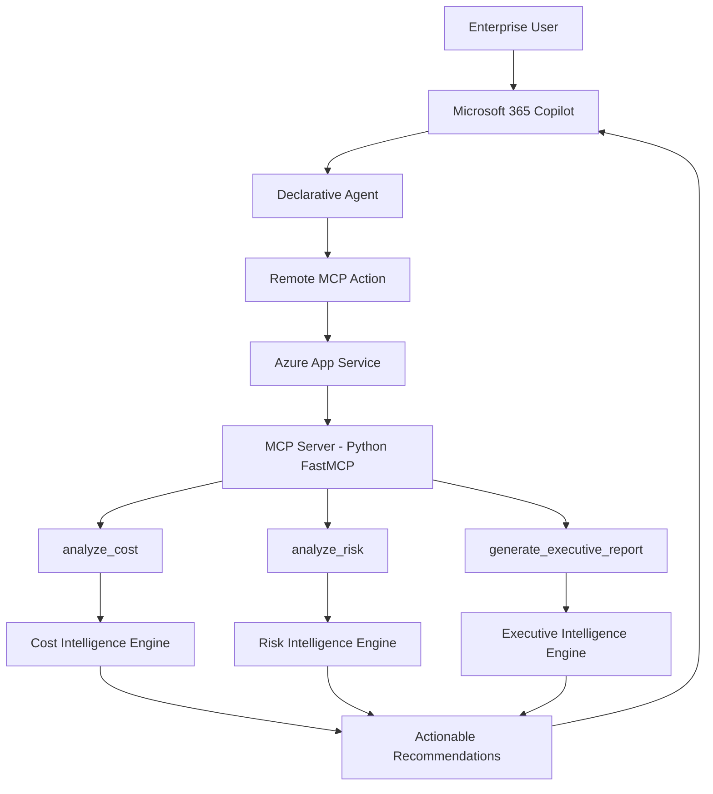

# CloudOps Intelligence Copilot

<p align="center">
  
  
  
  
</p>

<p align="center">
	<b>Enterprise Cloud Intelligence through Natural Language</b><br/>
	Turning Microsoft 365 Copilot into a FinOps, Risk, and Governance Advisor with MCP.
</p>

## Hero Banner

### Enterprise AI Agent for Cloud Cost, Risk, and Governance Intelligence

CloudOps Intelligence Copilot is a production-oriented enterprise AI agent built for the Microsoft Agents League Hackathon 2026, Enterprise Agents Category. It combines Microsoft 365 Copilot, Declarative Agents, and a custom Azure-hosted MCP server to deliver actionable cloud intelligence for engineering and executive stakeholders.

It is designed to answer the question judges care about most: can this move beyond a demo and become a real enterprise capability?

## Executive Summary

CloudOps Intelligence Copilot enables cloud platform teams, FinOps teams, SREs, cloud architects, and executives to ask business questions in natural language and get structured, tool-backed insights across Azure, AWS, and GCP.

Instead of relying on generic LLM responses, the solution invokes MCP tools that run deterministic analysis pipelines for:

- Cost optimization
- Risk assessment
- Executive governance reporting

The result is explainable, actionable intelligence that improves cloud decisions and accelerates enterprise outcomes.

## Problem Statement

Enterprise cloud operations often struggle with fragmented visibility and slow decision loops:

- Cost insights are trapped across dashboards and billing exports.
- Risk and governance findings are distributed across engineering systems.
- Executive reporting is manual, time-consuming, and not continuous.
- Teams need multi-cloud insights, but tools are often cloud-specific.

This creates delayed action, avoidable spend, and governance blind spots.

## Why This Matters

Cloud is now a board-level concern. FinOps discipline, governance maturity, and risk posture directly influence EBITDA, compliance readiness, and delivery velocity.

CloudOps Intelligence Copilot closes the gap between raw telemetry and executive action by making cloud intelligence conversational, trustworthy, and operationally useful.

The core shift is simple: instead of asking teams to manually interpret dashboards, this solution lets leaders ask questions in plain English and receive structured, explainable intelligence backed by tools.

## Solution Overview

CloudOps Intelligence Copilot extends Microsoft 365 Copilot with a remote MCP Action that connects to a Python-based FastMCP server on Azure App Service.

The MCP server exposes three high-value capabilities:

1. Cost analysis
2. Risk analysis
3. Executive report generation

This architecture separates conversational UX from analytical execution, enabling enterprise-grade extensibility, control, and auditability.

Why MCP instead of LLM-only responses:

- LLMs summarize; MCP tools execute.
- LLMs can infer; MCP tools can calculate.
- LLMs can sound confident; MCP tools can produce evidence.
- LLMs can hallucinate; MCP tools keep the answer grounded in analysis.

## Why MCP Matters

Many AI assistants rely solely on LLM reasoning.

CloudOps Intelligence Copilot uses MCP to connect Microsoft 365 Copilot with deterministic cloud intelligence tools.

Benefits:

- Reduced hallucinations
- Explainable outputs
- Repeatable analysis
- Enterprise governance alignment
- Clear separation between AI orchestration and business logic

This allows Copilot to move beyond conversation and perform actionable cloud intelligence tasks.

## Architecture Innovation

Traditional Copilot extensions often rely on prompt engineering and static retrieval.

CloudOps Intelligence Copilot introduces a tool-grounded architecture where Microsoft 365 Copilot orchestrates MCP actions that execute deterministic cloud intelligence workflows.

This pattern creates a separation between reasoning, execution, and presentation, making the solution more explainable, governable, and enterprise-ready.

## Key Features

| Capability | What It Delivers | Primary Personas |
|---|---|---|
| Cloud Cost Optimization | Underutilization detection, rightsizing guidance, savings opportunities, FinOps insights | FinOps, Cloud Architects, Platform Teams |
| Cloud Risk Analysis | Operational and security findings, governance observations, remediation recommendations | SRE, Security, Cloud Governance |
| Executive Governance Reporting | Leadership-ready summaries, cloud health framing, strategic recommendations | CTO, CIO, VP Engineering, Finance Leaders |
| Cross-Cloud Coverage | Unified analysis patterns across Azure, AWS, and GCP | Multi-cloud Enterprises |
| Copilot-native Experience | Natural language interaction in Microsoft 365 Copilot | Business + Technical Stakeholders |

## Hackathon Alignment

| Hackathon Criterion | How CloudOps Intelligence Copilot Delivers |
|---|---|
| Innovation | Turns Microsoft 365 Copilot into a cloud governance advisor through tool-grounded AI |
| Enterprise Value | Connects FinOps, risk, and executive reporting into one decision layer |
| Microsoft Ecosystem Integration | Built on Microsoft 365 Copilot, Agents Toolkit, Entra ID, and Azure App Service |
| MCP Implementation | Uses remote MCP actions and FastMCP tools instead of prompt-only responses |
| User Experience | Natural language interface for technical and non-technical stakeholders |
| Scalability | Stateless HTTP service pattern on Azure App Service |
| Security | Enterprise identity, controlled endpoints, and restricted transport settings |
| Production Readiness | Clear deployment model, health endpoint, startup command, and tool separation |

## Architecture Diagram (Mermaid)



## End-to-End Workflow

1. A user asks a business question in Microsoft 365 Copilot.
2. Declarative Agent selects a mapped MCP action.
3. Remote MCP call is sent to Azure-hosted MCP endpoint.
4. FastMCP tool executes the relevant analysis module.
5. Structured output is returned with findings and recommendations.
6. Copilot presents concise, business-friendly insights to the user.

## MCP Tooling

The MCP layer is intentionally small and focused. Each tool maps to a business outcome rather than a generic capability.

| MCP Tool | Business Purpose | Primary Output |
|---|---|---|
| `analyze_cost` | Identifies underutilized resources and savings opportunities | Cost optimization insights |
| `analyze_risk` | Surfaces operational, security, and governance risk signals | Risk findings and recommendations |
| `generate_executive_report` | Summarizes cloud intelligence for leadership | Executive-ready governance report |

This design keeps the system understandable for judges, extensible for engineers, and useful for business leaders.

## Live MCP Execution Evidence

The following MCP tools were successfully invoked through Microsoft 365 Copilot:

- analyze_cost
- analyze_risk
- generate_executive_report

Remote MCP Server deployed on Azure App Service.

Endpoint:

- https://cloudops-mcp-suvendu.azurewebsites.net/mcp

Execution logs captured from Azure App Service demonstrate successful remote MCP tool invocation and response generation.

## MCP Architecture Deep Dive

### Design Principles

- Tool-grounded responses over purely generative responses
- Clear separation of orchestration and analytical execution
- Stateless HTTP MCP transport for scalable deployment
- Secure remote hosting with controlled origins/hosts

### Implemented MCP Tools

| Tool Name | Purpose | Output Type |
|---|---|---|
| analyze_cost | Detect cloud cost inefficiencies and optimization opportunities | JSON findings + recommendations |
| analyze_risk | Identify operational/security risk posture and priority issues | JSON findings + remediation guidance |
| generate_executive_report | Synthesize cost and risk into executive narrative and action plan | JSON executive report |

### Runtime Notes

- MCP endpoint: /mcp
- Health endpoint: /healthz
- Transport model: Streamable HTTP via FastMCP
- Deployment model: ASGI app on Azure App Service

## Technology Stack

| Layer | Technologies |
|---|---|
| User Experience | Microsoft 365 Copilot, Declarative Agent |
| Agent Framework | Microsoft 365 Agents Toolkit |
| Protocol Layer | Model Context Protocol (MCP) |
| Backend | Python, FastMCP, Starlette, Uvicorn, Gunicorn |
| Cloud Hosting | Azure App Service |
| Identity & Access | Microsoft 365 tenant authentication |
| Development | VS Code, GitHub Copilot |
| Data Inputs | Cloud cost and risk datasets (extensible to live APIs) |

## Demo Scenarios

| Scenario | Prompt Intent | Expected Outcome |
|---|---|---|
| FinOps Weekly Review | Find top cloud waste drivers | Ranked savings opportunities with rightsizing actions |
| SRE Risk Standup | Highlight highest operational risks | Prioritized risk list with remediation recommendations |
| Executive Steering Meeting | Summarize cloud governance health | Executive brief with strategic guidance and maturity framing |
| Multi-cloud Health Check | Compare risk and cost posture across clouds | Consolidated, cross-cloud intelligence view |

## Sample Prompts

- Which resources are most underutilized and what are the top savings opportunities this month?
- Provide a risk summary across our cloud estate and identify critical issues first.
- Generate an executive governance report for leadership with top recommendations.
- Compare cost optimization opportunities across Azure, AWS, and GCP.
- What governance controls should we prioritize next quarter to reduce operational risk?

## Business Impact

| Business Dimension | Impact |
|---|---|
| Cost Efficiency | Reduces cloud waste and improves ROI of cloud investments |
| Governance Maturity | Creates repeatable governance insights for decision makers |
| Risk Reduction | Improves visibility into operational and security exposures |
| Decision Velocity | Speeds up insight-to-action cycle through conversational UX |
| Executive Alignment | Converts technical findings into leadership-ready narratives |

## Security & Governance

- Microsoft 365 tenant authentication-backed access patterns
- Remote MCP action with controlled endpoint integration rather than direct data-plane exposure
- Transport security policies in the MCP server to reduce host/origin abuse risk
- Allowed hosts and allowed origins restrictions for runtime hardening
- Stateless service model suitable for secure scale-out patterns and easier operational control
- Azure App Service deployment path supports HTTPS termination and managed runtime operations
- Tool-based design improves governance by making action boundaries explicit and auditable

## Scalability and Extensibility

### Scalability

- App Service horizontal scaling for concurrent MCP requests
- Stateless tool execution model supports elastic scaling
- Separation of agent experience and analytics engine simplifies independent scaling

### Extensibility

- Add new MCP tools without redesigning Copilot interaction model
- Extend from CSV-backed analytics to live cloud APIs
- Integrate additional enterprise data sources for contextual grounding
- Introduce policy-as-code and automated remediation workflows

## Future Roadmap

### Future Enhancements

- Microsoft 365 contextual grounding through Work IQ
- SharePoint knowledge integration
- OneDrive business document grounding
- Teams meeting context awareness
- Organizational memory

### Phase 3

- Real-time cloud APIs
- Historical trend analysis
- Predictive cost forecasting
- Automated remediation

## Screenshots

Capture and store the following screenshots in [docs/screenshots](docs/screenshots):

### Cost Optimization Analysis


### Risk Assessment


### Executive Governance Report


### MCP Tool Execution


## Video Demo Section

### Suggested Demo Flow (3-5 minutes)

1. Problem context and enterprise value
2. Architecture walkthrough (Copilot -> MCP -> Azure App Service)
3. Live prompt: cost optimization
4. Live prompt: risk analysis
5. Live prompt: executive reporting
6. Business impact recap and roadmap

### Video Link

- Add your demo link here: VIDEO_LINK_PLACEHOLDER

## Repository Structure

```text
.
├── CloudOps Intelligence Copilot/
├── mcp-server/
│   ├── server.py
│   ├── cost_analyzer.py
│   ├── risk_analyzer.py
│   ├── executive_report.py
│   └── datasets/
├── docs/
│   ├── architecture/
│   ├── screenshots/
│   └── submission/
├── tests/
├── README.md
└── LICENSE
```

## Local Development

### Prerequisites

- Python 3.10+
- Node.js 18/20/22
- Microsoft 365 Agents Toolkit extension in VS Code
- Microsoft 365 development tenant and Copilot license

### Run MCP Server Locally

```powershell
cd "mcp-server"
python -m pip install -r requirements.txt
$env:HOST = "0.0.0.0"
$env:PORT = "8000"
python server.py
```

### Validate Local Endpoints

```powershell
Invoke-WebRequest -Uri "http://localhost:8000/healthz" -Method GET
```

MCP endpoint for tooling and integration tests:

- http://localhost:8000/mcp

### Agent Experience

1. Open the project folder in VS Code.
2. Sign in with Microsoft 365 Agents Toolkit.
3. Configure the remote MCP action to point to the deployed or local server.
4. Provision and debug the Declarative Agent in Microsoft 365 Copilot.

## Azure Deployment

### Target Runtime

- Azure App Service (Linux)
- Python ASGI runtime using Gunicorn + Uvicorn workers

### Required App Settings

- PORT=8000
- HOST=0.0.0.0

### Startup Command

```bash
gunicorn --chdir mcp-server --bind 0.0.0.0:$PORT --worker-class uvicorn.workers.UvicornWorker server:app
```

### Post-Deployment Checks

1. Verify the health endpoint on the Azure app URL at /healthz.
2. Validate the MCP endpoint at /mcp using MCP Inspector or a compatible MCP client.
3. Update the Declarative Agent MCP action URL to the production endpoint.
4. Confirm Microsoft Entra ID and App Service settings match the intended enterprise environment.

## Why This Project Can Transform Cloud Operations

CloudOps Intelligence Copilot bridges a critical enterprise gap: turning fragmented, technical cloud data into conversational, executive-grade intelligence that can be consumed by both engineers and business leaders.

Its strategic advantage is the combination of:

- Familiar Microsoft 365 Copilot user experience
- Deterministic MCP tool execution for trustworthy outputs
- Multi-cloud business relevance
- A practical path from hackathon prototype to production-grade platform capability

This is not just an AI chat interface; it is an enterprise decision intelligence layer for modern cloud operations.

For Microsoft product teams and hackathon judges, the architectural significance is clear: this pattern shows how Copilot can move from answering questions to operationalizing decisions.

## Hackathon Submission Conclusion

CloudOps Intelligence Copilot demonstrates how Microsoft 365 Copilot, Declarative Agents, and MCP can transform enterprise cloud operations from dashboard-driven monitoring into conversational decision intelligence.

The solution provides a practical blueprint for FinOps, governance, and cloud operations teams to operationalize AI while maintaining explainability, control, and enterprise readiness.

For judges, the key takeaway is this: the project is not a chatbot that talks about cloud operations. It is a Copilot-native enterprise agent that performs cloud intelligence work with explainability, architectural clarity, and a credible path to production.

---

### Built for Microsoft Agents League Hackathon 2026

Enterprise Agents Category | CloudOps Intelligence Copilot